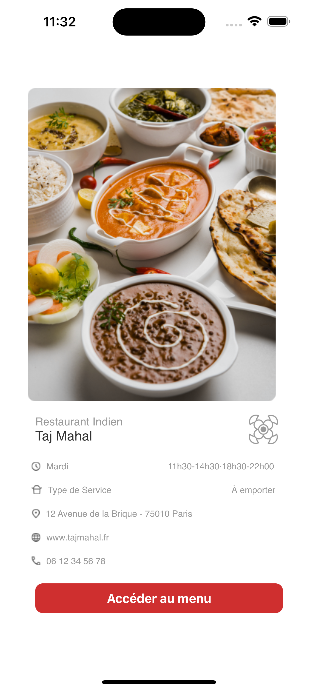

<p align="center" style="border-radius: 10px; display: block;">
    
</p>

# Taj Mahal
# Développement iOS avec Xcode, Swift et SwiftUI

## Description
Ce projet vise à mettre en pratique vos compétences en développement iOS en créant une application à l'aide d'Xcode, du langage de programmation Swift et du framework SwiftUI. Vous apprendrez également à gérer le code source avec Git et GitHub pour le développement collaboratif.

## Fonctionnalités
- Créer une interface utilisateur attractive et interactive avec SwiftUI.
- Gérer le code source avec Git et GitHub.
- Intégrer des fonctionnalités spécifiques pour une application de restaurant, telles que :
  - Affichage des menus.
  - Affichage des détails des plats et de la devanture du restaurant.

## Prérequis
- Un ordinateur fonctionnant sous macOS.
- La dernière version d'Xcode, disponible gratuitement sur l'App Store.
- Une bonne compréhension de Swift et des concepts de développement iOS.

## Environnement de développement recommandé
Xcode est l'environnement de développement intégré (IDE) développé par Apple, spécialement conçu pour le développement d'applications iOS. Il est fortement recommandé pour ce projet.

## Utilisation
1. Clonez le dépôt GitHub du projet sur votre machine locale:
   ```bash
   git clone https://github.com/your-username/your-repository.git

2. Ouvrez le projet dans Xcode en utilisant le fichier .xcworkspace file.
3. Explorez le code source et familiarisez-vous avec la structure du projet.
4. Apportez les modifications nécessaires en fonction de vos besoins.
5. Exécutez l'application sur le simulateur iOS ou sur votre appareil iOS personnel pour tester ses fonctionnalités.

## Captures d'écran


| <p align="center"></p> | <p align="center"></p> | <p align="center"></p> |
|:---:|:---:|:---:|
| **Home screen** | **Menu** | **Details of the dishes**

## Contribution

Nous encourageons les contributions à ce projet. Pour contribuer, suivez ces étapes :

1. Clonez le dépôt GitHub sur votre machine locale.
2. Créez une branche dédiée pour vos modifications :
   
git checkout -b your-branch-name

4. Apportez vos modifications dans votre branche.
5. Soumettez une pull request pour que vos changements soient examinés et intégrés au projet principal.

## Avertissement
Ce projet est fourni à des fins éducatives et comme exemple. Il sert de base pour le développement d'applications iOS avec Swift et SwiftUI, mais ne représente pas une application complète.

Licence
Ce projet est sous licence MIT. Veuillez consulter le fichier LICENSE pour plus de détails.

